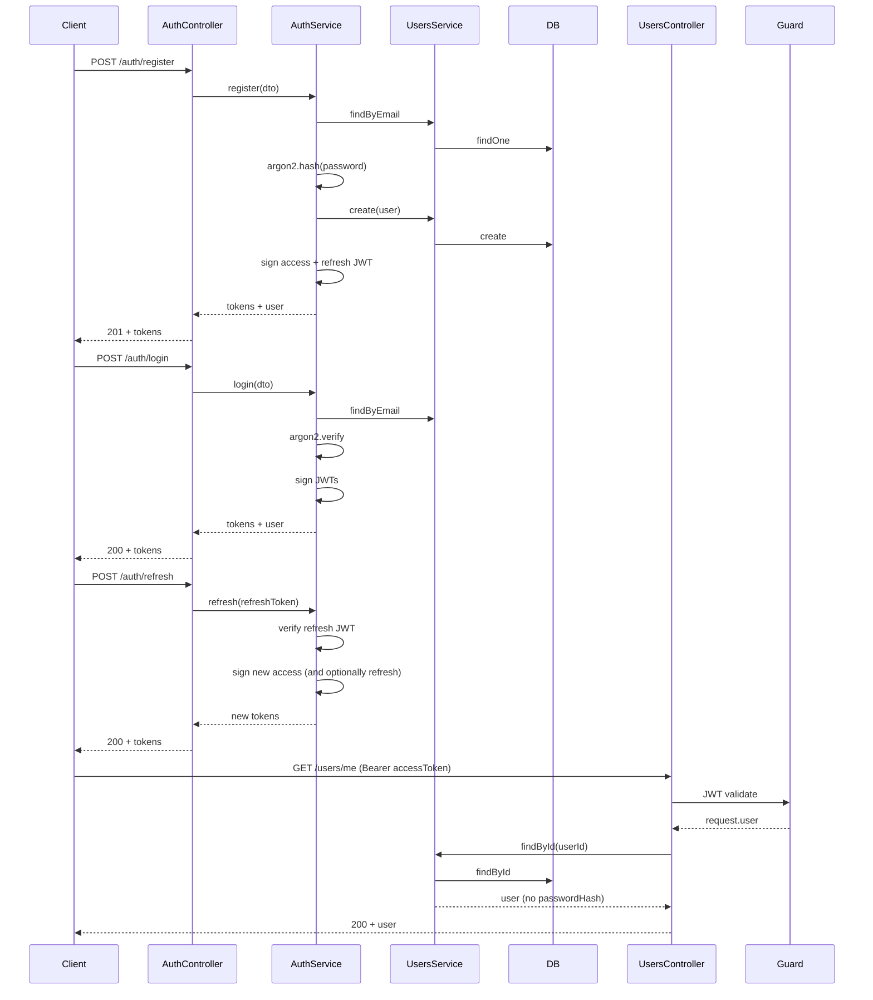

# Authentication Module – Step-by-Step Plan

This plan implements **User Authentication** and the **User schema** per the [WePay PDF](file:///Users/swatimohanty/Downloads/WePay.pdf): register, login, refresh, logout, and the User APIs (GET/PATCH/DELETE `/users/me`). The stack uses **MongoDB (Mongoose)**, **JWT** for tokens, and **argon2** for password hashing (dependencies already in [package.json](package.json)).

---

## 1. Database and configuration

- **MongoDB connection**  
  - In [src/app.module.ts](src/app.module.ts): import `MongooseModule.forRoot()` (or `forRootAsync` with `ConfigService`).  
  - Use an env var (e.g. `MONGODB_URI`) for the connection string.
- **ConfigModule**  
  - Import `ConfigModule.forRoot({ isGlobal: true })` in `AppModule` so `JWT_SECRET`, `JWT_REFRESH_SECRET`, and token expiry can be read via `ConfigService` everywhere.
- **Environment variables** (document in README or `.env.example`):  
`MONGODB_URI`, `JWT_SECRET`, `JWT_REFRESH_SECRET`, `JWT_ACCESS_EXPIRY`, `JWT_REFRESH_EXPIRY`.

---

## 2. User schema and UsersModule

- **User schema** (per PDF “User Schema”):  
`_id`, `name`, `email` (unique, indexed), `passwordHash`, `avatarUrl`, `createdAt`, `updatedAt`.  
  - Create a Mongoose schema (e.g. `src/modules/users/schemas/user.schema.ts`) and export a **User** model.
- **UsersModule**  
  - Register the User schema with `MongooseModule.forFeature([{ name: User.name, schema: UserSchema }])`.  
  - Implement **UsersService** with:  
    - `findByEmail(email)`  
    - `findById(id)`  
    - `create(userDto)` (used by Auth for registration; password hashing stays in AuthService).
  - Do **not** expose `passwordHash` in responses (use a schema method or transform to omit it).
- **UsersController** (stub exists at [src/modules/users/users.controller.ts](src/modules/users/users.controller.ts)):  
  - Add **GET /users/me**, **PATCH /users/me**, **DELETE /users/me** (per PDF).  
  - All three must be **protected** (require a valid JWT); get current user from request (e.g. `@Req()` and a JWT payload or a custom `@CurrentUser()` decorator that reads from the guard).

---

## 3. Auth module – DTOs and validation

- **Register DTO**: `email`, `password`, `name` (and optionally `avatarUrl`). Use `class-validator` (e.g. `IsEmail`, `IsString`, `MinLength` for password, `IsOptional` for avatar).
- **Login DTO**: `email`, `password`.
- **Response DTOs**: e.g. `AuthResponseDto` or plain type with `accessToken`, `refreshToken`, and optionally `user` (id, email, name, avatarUrl – no `passwordHash`).
- Use `ValidationPipe` globally in [src/main.ts](src/main.ts) so DTOs are validated on all routes.

---

## 4. Auth service – core logic

In [src/modules/auth/auth.service.ts](src/modules/auth/auth.service.ts):

- **Register**  
  - Validate that email is not already in use (call `UsersService.findByEmail`).  
  - Hash password with **argon2**.  
  - Call `UsersService.create` with `name`, `email`, `passwordHash`, `avatarUrl`.  
  - Optionally return tokens (same shape as login) or just user; spec says “register” so returning tokens on register is typical.
- **Login**  
  - Find user by email; verify password with argon2.  
  - If valid: generate **access** and **refresh** JWTs (using `JwtService`), return them (and optionally user info).
- **Refresh**  
  - Accept a **refresh token** (from body or header).  
  - Verify with `JwtService` using refresh secret; if valid, issue a new access (and optionally new refresh) token.
- **Logout**  
  - Per PDF, “log out securely”. Options: (a) stateless JWT: return 200 and document that client discards tokens; (b) optional refresh-token blacklist in DB/cache for revoking refresh tokens. Plan for (a) first; blacklist can be a later step.

Use `ConfigService` for JWT secrets and expiry. Inject `UsersService` and `JwtService` into `AuthService`.

---

## 5. JWT strategy and guards

- **JwtModule**  
  - Register in `AuthModule` with `registerAsync` using `ConfigService`: secret and access-token expiry. Use the same secret/expiry that AuthService uses for **access** tokens.
- **JWT Strategy** (Passport):  
  - Extract JWT from header (e.g. `Authorization: Bearer <token>`).  
  - Validate signature and expiry; attach user (e.g. `userId` and email) to `request.user`.
- **Guard**  
  - Use `AuthGuard('jwt')` (or a thin wrapper) to protect routes that require authentication.
- **Optional**: `@CurrentUser()` custom parameter decorator that reads `request.user` so controllers can use `@CurrentUser() user` instead of `@Req() req`.

---

## 6. Auth controller – routes

In [src/modules/auth/auth.controller.ts](src/modules/auth/auth.controller.ts) implement:

- **POST /auth/register** – body: register DTO. Call `AuthService.register`, return tokens (+ user if desired).
- **POST /auth/login** – body: login DTO. Call `AuthService.login`, return tokens (+ user).
- **POST /auth/refresh** – body (or header): refresh token. Call `AuthService.refresh`, return new tokens.
- **POST /auth/logout** – no body required; if you add blacklist later, pass refresh token. Return 200.

None of these routes need to be protected by the JWT guard (they are the ones that *issue* or refresh tokens).

---

## 7. Wire Auth and Users

- **AuthModule**  
  - Import `UsersModule` (to use `UsersService`), `JwtModule`, and Passport with the JWT strategy.  
  - Export `AuthService` if any other module (e.g. future Guards) needs it.
- **UsersModule**  
  - Import `MongooseModule.forFeature` for the User schema.  
  - Ensure **GET/PATCH/DELETE /users/me** are protected (e.g. `UseGuards(AuthGuard('jwt'))` and current user from `request.user`).
- **AppModule**  
  - Import `MongooseModule`, `ConfigModule`, and ensure `AuthModule` and `UsersModule` are imported (already present; add Config + Mongoose).

---

## 8. Flow summary

---

## 9. Suggested file checklist

| Area               | Files to add or modify                                                                                                                                                                                                       |
| ------------------ | ---------------------------------------------------------------------------------------------------------------------------------------------------------------------------------------------------------------------------- |
| Config & DB        | [src/app.module.ts](src/app.module.ts) (ConfigModule, MongooseModule)                                                                                                                                                        |
| User               | `src/modules/users/schemas/user.schema.ts` (new), [users.module.ts](src/modules/users/users.module.ts), [users.service.ts](src/modules/users/users.service.ts), [users.controller.ts](src/modules/users/users.controller.ts) |
| Auth DTOs          | `src/modules/auth/dto/register.dto.ts`, `login.dto.ts`, `auth-response.dto.ts` (or types)                                                                                                                                    |
| Auth logic         | [auth.service.ts](src/modules/auth/auth.service.ts), [auth.controller.ts](src/modules/auth/auth.controller.ts)                                                                                                               |
| JWT                | `src/modules/auth/strategies/jwt.strategy.ts`, [auth.module.ts](src/modules/auth/auth.module.ts) (JwtModule, PassportModule)                                                                                                 |
| Guards & decorator | `src/common/guards/jwt-auth.guard.ts` (optional), `src/common/decorators/current-user.decorator.ts` (optional)                                                                                                               |
| Main               | [src/main.ts](src/main.ts) (ValidationPipe)                                                                                                                                                                                  |

---

## 10. Testing and security notes

- **Tests**: Add unit tests for `AuthService` (register duplicate email, login wrong password, refresh invalid token) and for `UsersService`. E2E tests for POST /auth/register, POST /auth/login, and GET /users/me with/without token.
- **Security**: Never return `passwordHash`; use short access expiry (e.g. 15m) and longer refresh (e.g. 7d); keep JWT secrets in env only.

This sequence gives you a clear order: config + DB → User model + UsersService → Auth DTOs and AuthService → JWT strategy and guards → Auth and Users controllers → wire modules and protect `/users/me`.