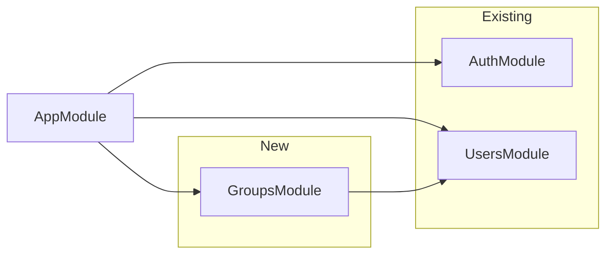

# Group APIs Implementation Plan

## Context from WePay PRD

- **Group APIs (Section 7):**  
`POST /groups`, `GET /groups`, `GET /groups/:id`, `PATCH /groups/:id`, `DELETE /groups/:id`, `POST /groups/:id/members`
- **Group management (Section 3.2):** Create group, add members, remove members, leave group, view group balance summary.
- **Group schema (Section 8):** `_id`, `name`, `createdBy`, `members: [userId]`, `createdAt`.

Auth and User APIs are already in place; we will follow the same patterns (JWT guard, `CurrentUser`, Mongoose, DTOs, Swagger).

## Architecture

- **GroupsModule** will depend on **UsersModule** (e.g. to resolve member IDs to user info for responses).
- All group routes are protected with `AuthGuard('jwt')` and use `@CurrentUser()` for `createdBy` and membership checks.

## 1. Group schema and collection

**File:** `src/modules/groups/schemas/group.schema.ts`

- Mirror PRD: `name` (string), `createdBy` (ObjectId ref to User), `members` (array of ObjectId refs to User), `createdAt`/`updatedAt` (timestamps).
- Use explicit `collection: 'groups'`.
- Indexes: `createdBy`, and `members` for member lookups.

Ensure `createdBy` is always in `members` (e.g. add creator to members in service on create).

## 2. DTOs

- **CreateGroupDto:** `name` (required, string, max length).
- **UpdateGroupDto:** `name` (optional, partial).
- **AddMembersDto:** `memberIds: string[]` (array of user IDs to add).
- **GroupResponseDto** (or interface): `id`, `name`, `createdBy` (user id), `members` (array of user ids or minimal user info), `createdAt`, `updatedAt`. Optional: `balanceSummary` stub (e.g. `{ totalOwed, totalOwing, netBalance }` with zeros) for later use with Expenses.

## 3. Groups service

**File:** `src/modules/groups/groups.service.ts`

- **create(name, userId):** Create group with `createdBy: userId`, `members: [userId]`. Return saved group.
- **findAll(userId):** Return groups where `members` contains `userId` (user’s groups).
- **findOne(id, userId):** Return group by id; throw `NotFoundException` if missing; optionally check membership for strict “only members can view” (recommended).
- **update(id, userId, dto):** Update name; ensure caller is member (or only creator). Throw if not found or forbidden.
- **delete(id, userId):** Delete group; ensure caller is creator (or at least member). Throw if not found or forbidden.
- **addMembers(groupId, userId, memberIds):** Ensure caller is member; add valid user ids to `members` (no duplicates); ignore if already in group; validate user ids exist via UsersService if needed.
- **removeMember(groupId, userId, memberIdToRemove):** Ensure caller is member (or creator-only for remove-others). Remove `memberIdToRemove` from `members`. If removing self → “leave group” (allowed). If removing last member, consider deleting group or forbidding.
- **getBalanceSummary(groupId, userId):** Stub: return zeros or placeholder; real implementation when ExpensesModule and SettlementsModule exist.

Use `UsersService.findById` (or a small batch helper) where you need to validate or return user info for members.

## 4. Groups controller

**File:** `src/modules/groups/groups.controller.ts`

- Base path: `@Controller('groups')`, `@UseGuards(AuthGuard('jwt'))`.
- **POST /groups** — `CreateGroupDto` → `groupsService.create(dto.name, payload.sub)`.
- **GET /groups** — list current user’s groups → `groupsService.findAll(payload.sub)`.
- **GET /groups/:id** — get one (and optional balance summary stub) → `groupsService.findOne(id, payload.sub)`.
- **PATCH /groups/:id** — `UpdateGroupDto` → `groupsService.update(id, payload.sub, dto)`.
- **DELETE /groups/:id** — `groupsService.delete(id, payload.sub)`.
- **POST /groups/:id/members** — `AddMembersDto` → `groupsService.addMembers(id, payload.sub, dto.memberIds)`.

Add one of the following for “remove member” / “leave”:

- **Option A (recommended):**  
  - `DELETE /groups/:id/members/:memberId` — remove a member; if `memberId === payload.sub` then treat as “leave group”.
- **Option B:**  
  - `DELETE /groups/:id/members/:memberId` for remove-other;  
  - `POST /groups/:id/leave` (no body) for leave (calls same underlying “remove self” logic).

Use `ParseMongoIdPipe` or equivalent for `:id` and `:memberId` to validate ObjectIds and return 400 when invalid.

## 5. Module and app registration

- **GroupsModule:**  
  - Import `MongooseModule.forFeature([GroupSchema])`, `UsersModule`.  
  - Register `GroupsService`, `GroupsController`.  
  - Export `GroupsService` if other modules (e.g. Expenses, Notifications) will need it later.
- **AppModule:**  
  - Import and add `GroupsModule` to `imports`.

## 6. Authorization rules (summary)

| Action        | Who can do it                                                         |
| ------------- | --------------------------------------------------------------------- |
| Create group  | Any authenticated user                                                |
| List groups   | Groups where user is in `members`                                     |
| Get / update  | Only members                                                          |
| Delete group  | Only creator (`createdBy`)                                            |
| Add members   | Only members (or only creator – your choice)                          |
| Remove member | Creator only when removing others; any member can remove self (leave) |

## 7. Optional enhancements (keep for later)

- **GET /groups/:id/summary** — dedicated balance summary endpoint (stub now; implement with expenses/settlements).
- Populate `createdBy` and `members` with minimal user info (id, name, avatarUrl) in responses.
- NotificationsModule: “Member added” / “Member removed” when we add that module.

## 8. Testing

- Unit tests for `GroupsService` (create, findAll, findOne, update, delete, addMembers, removeMember) with mocked User model and UsersService.
- Controller spec: mock GroupsService, verify guards and status codes for the group and member endpoints above.

## File checklist

| Item       | Path                                                                                                               |
| ---------- | ------------------------------------------------------------------------------------------------------------------ |
| Schema     | `src/modules/groups/schemas/group.schema.ts`                                                                       |
| DTOs       | `src/modules/groups/dto/create-group.dto.ts`, `update-group.dto.ts`, `add-members.dto.ts`, response type/interface |
| Service    | `src/modules/groups/groups.service.ts`                                                                             |
| Controller | `src/modules/groups/groups.controller.ts`                                                                          |
| Module     | `src/modules/groups/groups.module.ts`                                                                              |
| App        | Add `GroupsModule` to [src/app.module.ts](src/app.module.ts)                                                       |
| Tests      | `groups.service.spec.ts`, `groups.controller.spec.ts`                                                              |

No changes to existing auth or user routes are required; group routes will use the same JWT and `CurrentUser` pattern as [src/modules/users/users.controller.ts](src/modules/users/users.controller.ts).